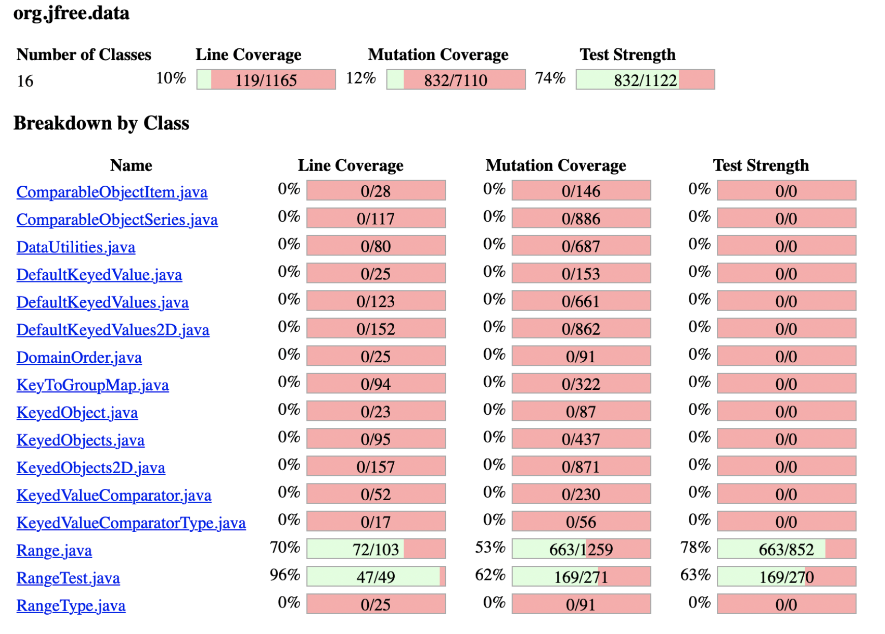
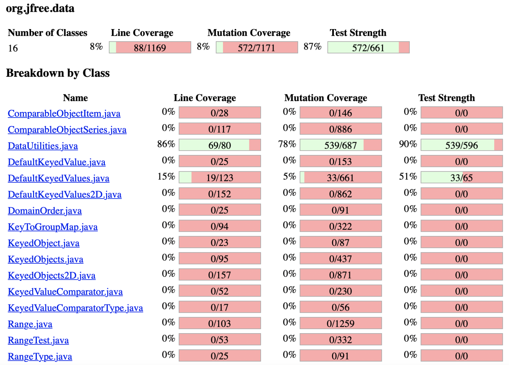
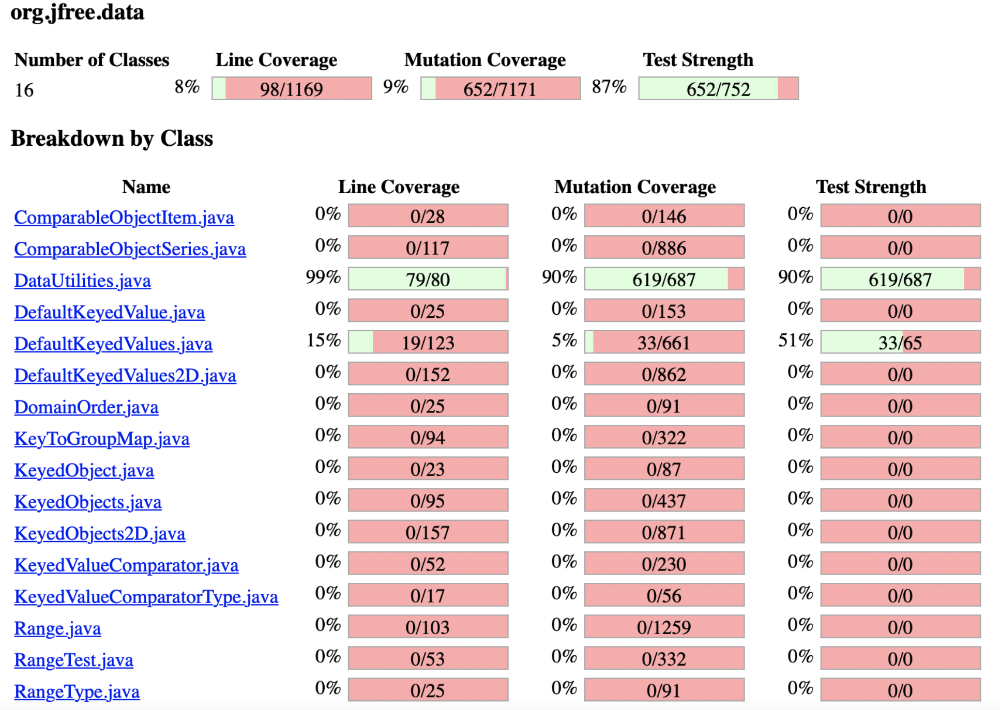

**SENG 438 - Software Testing, Reliability, and Quality**

**Lab. Report \#4 – Mutation Testing and Web app testing**

| Group \#:      | 19  |
| -------------- | --- |
| Student Names: | Alexander Burn   |
|                | William Perks    |
|                | Zohaib Ashfaq    |
|                | Khevin Jugessur   |

# Introduction

In this lab we will explore mutation and GUI testing.  We will use mutation testing on code we have written previously in assignment 3 and then we will use GUI testing to test the IKEA website.  Mutation testing is beneficial because it gives another way to test that your code functions the way it was intended to work.  GUI testing is beneficial because it gives a perspective of what the user sees and ensures that although your backend code may give correct output, it may not be shown correctly for the users.

# Analysis of 10 Mutants of the Range class 

i) combineIgnoringNaN: negated conditional -> KILLED 
For this mutant, the condition (range1 == null) is negated, our test cases are able to detect it and thus the mutant is killed.

ii) combineIgnoringNaN: removed conditional -> replaced equality check with false -> KILLED
For this mutant, the condition(range1 == null) is set to false, our test cases are able to detect it and the mutant is killed.

iii) intersects: replaced return of integer sized values with (x == 0? 1 :0) -> KILLED
For this mutant, return values of getLowerBound and getUpperBound are set to true if they are equal to 0 otherwise they are set to false. Our test cases are able to detect the mutant and the latter is killed.

iv) intersects: remove call to org/jfree/data/Range::getLowerBound -> KILLED
For this mutant, getLowerBound is not called in the return statement.  Our test cases are able to detect the mutant and the latter is killed.

v) getLowerBound : Incremented (a++) double field lower -> KILLED
For this mutant, the lower is post-incremented. Our test cases are able to detect the mutant and the latter is killed.

vi) <init>: Decremented (--a) double local variable number 1 -> SURVIVED
For this mutant, the lower is pre-decremented. Our test cases are not able to detect this mutant.

vii) getCentralValue: Decremented (a–) double field lower -> SURVIVED
For this mutant, the lower is post-decremented. Our test cases are not able to detect this mutant.

viii) getCentralValue: Substituted 2.0 with 1.0 -> KILLED
For this mutant, the divisor of 2 with 1.  Our test cases are able to detect this mutant.

ix) combineIgnoringNaN: equal or less to equal -> SURVIVED
For this mutant, the condition (range2 != null && range2.isNaNRange() ) is changed to less and equal to. Our test cases are not able to detect this mutant.
  
x) constrain: Negated double local variable number 1 -> SURVIVED
For this mutant, the variable result is negated. Our test cases are not able to detect this mutant.

# Report all the statistics and the mutation score for each test class
Mutation score for Range original:

Mutation score for Range updated:

Mutation score for DataUtilities original:

Mutation score for DataUtilities updated:

# Analysis drawn on the effectiveness of each of the test classes

For Range, we started out with a mutation score of 53% and after adding more test cases and looking into why the mutations survived we got a mutation score of 78%.  For DataUtilities, we started with a mutation score of 78% and after adding more test cases we got the mutation score to 90%.  What we noticed is that the more we increased the percentage the harder it became.  Although increasing the percentage as much as we can is ideal some of the mutations are impractical to test for and some may even be impossible to test.

# A discussion on the effect of equivalent mutants on mutation score accuracy

Equivalent mutants do not affect mutation score accuracy.  This is because equivalent mutants have the same functionality as the original code but it is not syntactically the same.  These mutants would survive and not be caught, however they do not impact the mutation score because they are not included in the calculation.

# A discussion of what could have been done to improve the mutation score of the test suites

One way we could increase the mutation score is by going to the PIT summary and going into either Range.java or DataUtilities.java and seeing what methods did not kill mutants and seeing why they were not killed.  After this, we could write test cases that would kill these mutants.  Another way is to write more tests without looking at the exact details.  Although this method would not be as effective and tedious it still should increase the mutation score.

# Why do we need mutation testing? Advantages and disadvantages of mutation testing

Mutation testing is a method of software testing in which small “mutations” are introduced into the source code of a program to see if the changes are being detected. This ultimately tests how effective the test cases are and what things can be changed. 
In terms of advantages to mutation testing:
It can help improve the quality of the test cases, and ultimately the test suite to see if any potential errors are being detected. Another advantage is that this technique can lead to detecting any faults early on in the process of developing software. In the real world, this can result in the saving of money and time. Using mutation testing can also help ensure that you are getting better coverage of the code.
When looking at the disadvantages of mutation testing:
For big projects this can be something that requires a lot of power in terms of computation which can be costly, so it has to be done very carefully. Leading on with that, as a result this process can also be time-consuming, especially when running multiple mutation tests.

# Explain your SELENUIM test case design process
  
  We chose to use Selenium to test Ikea’s website UI. Our test case design process involved understanding the use of the website from the user’s perspective. We wanted to test all of the primary functionalities that a general user would likely interact with during a session on Ikea’s website. The main functionalities we decided were adding items to cart and wishlist, checking the cart and wishlist, logging in, entering postal code for setting closest store and searching the site for items. We weren’t able to combine our selenium tests between our group, so we had to separate them into separate files. The test design we completed was efficient as it covered the majority of the user requirements. We feel confident that our SELENIUM test case design for the Ikea website UI was well structured to test the user’s experience.

# Explain the use of assertions and checkpoints

In SELENIUM, assertions and checkpoints are two features that automatically take place and help with the testing of automating web application tasks. Assertions are a feature that tests if a certain condition that is expected evaluates to true or false. Checkpoints are set to see if a page has loaded properly for example or a form has been submitted properly. If something fails, the program stops at that certain checkpoint, allowing for us to take a closer look at what happened and fix the issue. Both these features are very important when using the program and can be helpful in detecting any errors early on.

# how did you test each functionaity with different test data

How we went about this is by thinking about what a user would want to do on the website for IKEA.  For the test where we added an item to the cart all we had to do is just perform the test in the exact same way, except pick a different item to add.  For the other test cases we can change the data we want to test with respect to what we are testing.

# Discuss advantages and disadvantages of Selenium vs. Sikulix

Both Selenium and Sikulix are used for automating tests, they have their advantages/disadvantages. Selenium can be used on various web browsers which makes it very good for testing web based applications. It can also support various programming languages as well. However, it is not that great to use on applications that are not web based, and is where SikuliX performs better. Selenium also has a limited recognition of images and is another area where SikuliX excel at. SikuliX is python based making it easier to learn and use. It has an easy to set-up and use interface. However, it has a smaller user community and cannot provide as many features and support that Selenium provides.

# How the team work/effort was divided and managed

We made sure that for increasing the mutation score for Range and DataUtilities each group member contributed equally and if one of us got stuck the others would help and ensure that they understood the concept before moving on. We approached Selenium in the same way.

# Difficulties encountered, challenges overcome, and lessons learned

We had some difficulties setting up the environment for this assignment.  Understanding how to write effective test cases that would increase the mutation score was also initially challenging, after some time to think about it, it became clear how to go about writing test cases.

# Comments/feedback on the lab itself

In terms of the lab itself, the initial setup was something that we struggled with initially. For the instructions, it could have been helpful if a bit more information on how to interact with the software needed for this lab such as Selenium was provided. The lab was informative in terms of giving us the knowledge on how to work with GUIs and automation testing. Overall, it took a bit of time initially but was a smoother process as the lab progressed.
